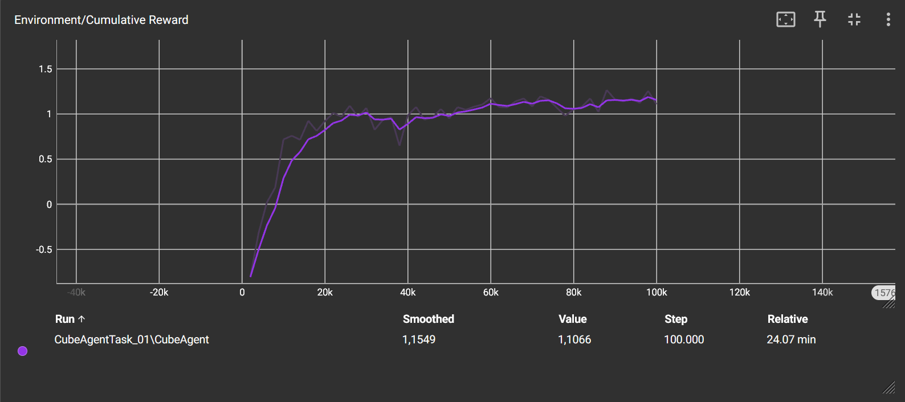
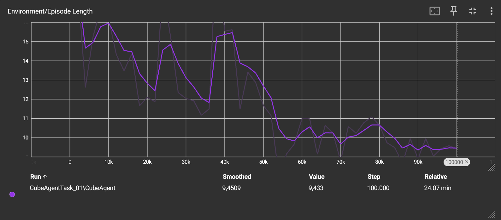
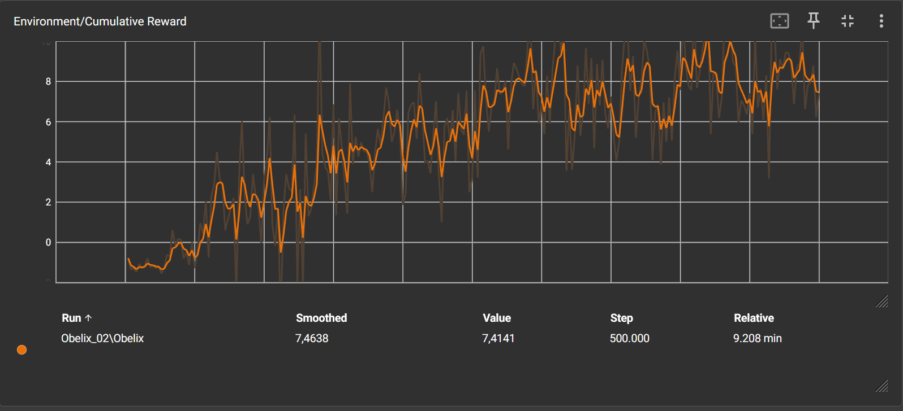

# Technisch rapport implementatie van tweefasige reinforcement learning in Unity ML-Agents met raycast

### Inleiding

    Het doel van dit rapport is om te documenteren hoe een Machine Learning agent getraind wordt om een sequentiële taak uit te voeren (eerst een object nemen en dan naar een groene zone te gaan).
    Dit rapport is voor ontwikkelaars, lectoren of mensen die meer willen weten over ML-Agents in een Unity 3D omgeving.
    Het gaat grotendeels over de verschillen zien tussen tussen absolute coördinaten (gps stijl) en de sensor-gebaseerde observaties (raycasting).

### Methoden

##### Behaviour Parameters

    Omdat er maar één parameter wordt meegegeven via het script, moet de space size op 1 staan terwijl de rest van de sensoren (die je zelf moet schrijven zonder raycasting) door raycasting automatisch worden afgehandeld.
    Er zijn twee acties die gedefinieerd zijn, één voor de voorwaardse acties (z-as) en één voor de roterende acties (y-as).

##### Agent componenten

    De Ray Perception Sensor 3D zorgt ervoor dat we verschillende componenten kunnen aanpassen zoals: aantal rays, graden van rays en detecteerbare tags zoals "Target" en "Green Zone" kunnen ingeven. Zonder deze tags gaat de agent niet werken omdat het door deze methode geen andere parameters meekrijgt van het script.
    De Decision Requestor zorgt ervoor dat de agent keuzes kan nemen en dus acties kan ondernemen langs het neurale netwerk.

##### Override methodes van de agent

    OnEpisodeBegin(): Beschrijft dat hier de omgeving gereset wordt. De Target wordt op een willekeurige plek geplaatst, de status (targetCollected) wordt gereset en de agent wordt teruggeplaatst indien die van het platform is afgevallen.

    CollectObservations(): De enige reden dat deze methode bestaat is om de huidige status door te geven aan de agent als een float. Er wordt bekeken of targetCollected true of false is, als die true is dan krijgt die 1.0f mee en false 0.0f.

    OnActionReceived(): Hier gebeurt de translatie van vectorwaarden naar fysieke beweging (translate en rotate). Hier wordt een deel van het rewardsysteem meegegeven, als hij valt wordt SetReward op -1f gezet en wordt de episode gestopt. Hier wordt ook een systeem geïmplementeerd die ervoor zorgt dat de agent elke iteratie minder en minder stappen doet om het doel te bereiken door -1f / MaxStep te doen. Dit zorgt ervoor dat hoe minder stappen = hoe meer score. MaxStep komt van de Agent parent class.

    Heuristic(): Het enige doel van deze methode is om zelf te testen via toetsenbordinput om te zien of er nog aanpassingen moeten gedaan worden aan bv. rotatiesnelheid of snelheid.

    OnTriggerEnter(): Is een extra methode die niet van de Agent class komt, maar cruciaal is voor de logica van de verschillende fases (rode kubus en groene zone). Hier worden ook positieve beloningen uitgegeven.

### Resultaten

##### TensorBoard Data

    De Cumulative Reward grafiek werd het meeste gebruikt omdat het zeer duidelijk de stijging toont van de startwaarde `-0.8103` tot aan de stabiele eindronde `1.107` na ongeveer `100.000` stappen.

##### Episode Length

    toont aan hoeveel efficiënter dat de agent wordt, hier vond ik het niet super duidelijk om te zien hoe veel beter de agent wordt omdat hij soms nieuwe dingen probeert waardoor hij some een langere totale tijd gaat behalen, wat niet altijd representief is over hoe goed hij het doet.

### Conclusie

    Uit de resultaten komt uit dat de combinatie van Ray Perception en een binaire statusvariabele voldoende informatie biedt aan het PPO-algoritme om een sequentiële, tweefasige taak op te lossen. Bij gevorderde taken gaat het zeker langer duren om dit model te trainen en slechtere resultaten opbrengen.

    Het toevoegen van een stappenalty is één van de belangrijkste toevoegingen voor efficiëntie en snelheid van het model. Het gebruik van visuele sensoren inplaats vann absolute coördinaten verhoogt de complexiteit van de training, maar zorgt voor een robuuster model dat onafhankelijk is van vaste coördinaten. Visuele sensoren zorgen ook voor gemak in het schrijven van het script.

### Referenties

    Unity Technologies (2022). _ML-Agents Documentation: Ray Perception Sensor_. Geraadpleegd via GitHub.
    (https://github.com/Unity-Technologies/ml-agents/tree/release_19_docs/docs)

    Introduction to Unity ML-agents (2023). Understand the Interplay of Neural Networks and Simulation Space Using the Unity ML-Agents Package. Geraadpleegd via PDF document.

# DEEL 2 (Obelix)

## Technisch rapport sequentiele taken leren in Unity ML-Agents

### Introductie

    Het doel van dit rapport is om het trainingsproces te documenteren van
    een ML-Agent (Obelix), gemaakt om een twee-phasige sequentiele taak
    te kunnen. De Agent moet een Menhir detecteren en oppakken, hierna
    gaat Obelix met de Menhir naar een drop-off plek (Destination).
    Dit document zorgt voor inzicht voor developers die willen zien hoe
    een Agent werkt en traint met een twee-phasige taak.

### Methodes

    De training gebeurt in een 3D arena waar de Agent van af kan vallen.
    De arena heeft altijd 5 Menhirs en 5 Destinations. De agent volgt een
    stricte set van physieke en logische regels:
    Het doel: de Agent moet al de menhirs 1-voor-1 oppakken en op de
    destinatie zien te krijgen. Wanneer de Destinatie berijkt is wordt
    de destinatie opaque en inactief.
    Een episode reset wanneer al de Menhirs succesvol zijn geplaatst, of
    het reset wanneer de Agent van het platform afvalt of hij het in te veel
    stappen doet.

### Agent Components en Observations (sensoren)

    De agent gebruikt een combinatie van Ray Perception Sensor 3D en
    Vector Observaties omdat de agent anders niet weet wanneer de Menhir
    op zijn rug is of niet. Dit zorgt voor meer consistente training
    zodat hij exact weet wat er gebeurt. Raycasting gebruikt twee tags:
    Menhir en Destination, dit wordt als parameter meegegeven.

### Reward systeem en mechanische balancering.

    Het reward systeem werd zeer specifiek toegepast zodat de agent niet
    vast blijft zitten op bepaalde punten.
    Een step penalty werd gegeven per stap dat gezet wordt om zo optimaal
    mogelijk het doel te bereiken.
    Wanneer de agent van de map valt krijgt hij direct -1.0f zodat hij
    direct een grote afstraffing krijgt als hij van het platform afvalt.
    De agent krijgt een reward van 1.0f wanneer hij een Menhir oppakt.
    Maar als de agent tegen een andere Menhir loopt terwijl hij een Menhir
    al vast heeft, krijgt hij een penalty van -0.1f. Dit zorgt ervoor dat
    de agent andere Menhirs niet probeert op te pakken om gratis rewards
    te krijgen.
    Wanneer de agent een Menhir op een destinatie plaatst krijgt hij 1.0f
    als reward, wanneer hij al de Menhirs correct plaatst krijgt hij een
    reward van 5.0f. Dit zorgt ervoor dat van het moment dat hij het één
    keer juist doet, hij direct weet wat voor de volgende keer te doen.
    Wat me na de eerste iteratie opviel was dat hij zeer "jitter" rondliep,
    dit werd door Hyperparameters te veranderen en in de inspector de
    "Take action between steps" aan te zetten. Zonder dit wist hij niet goed
    hoe rond te bewegen.

### Hyperparameters

    Het model werd geconfigureerd met een maximum van 500,000 stappen,
    een batch_size van 1024 en een large buffer_size van 10240.
    Dit werd gebruikt zodat hij stabiele updates teruggaf voor een duidelijk
    beeld van de training. Observation normalization werd op true gezet
    zodat het netwerk proces beter visuele en binaire statussen begrijpt.

### Resultaten

#### TensorBoard Data: Cumulatieve Rewards

    In het begin was de cumulatieve reward score negatief. De agent viel
    regelmatig van de map af, of kreeg veel penalties omdat hij het pick-up
    mechanisme nog niet snapte. Moment dat hij zag dat de Menhir direct een
    1.0f reward gaf steeg de grafiek zeer snel, met een caveat: hij probeerde
    direct erna alleen maar andere Menhirs aan te raken voor dezelfde reward.
    Nadat hij toevallig over een Destination ging kreeg hij nogeens 1.0f reward.
    Dit zorgde ervoor dat hij snel begreep wat het doel was. Nadat hij het
    doel meerdere keren behaalde kreeg de agent 5.0f reward erbij, dit kan
    je ook zien in de graph rond 150,000 stappen. Dit is de reden waarom de
    grafiek begint te stabiliseren na dit punt, hij wist wat te doen en vond
    een snellere manier om dit te doen, maar maakte natuurlijk soms nog fouten.

### Conclusie

    De resultaten demostreren dat een agent trainen die meerdere taken doet,
    een complexe situatie maakt met veel veranderingen in de code en bugs.
    Het rewardsysteem werd meerdere keren aangepast samen met de Hyperparameters,
    Dit zorgde voor een optimaal maar ingewikkeld proces. Het implementeren
    van logische penalties zoals de agent die een andere Menhir raakt terwijl
    hij al een Menhir op zijn rug heeft was noodzakelijk zodat hij verder
    geraakte in zijn training, zonder dit zou hij vast blijven op de eerste taak.
    De patronen van de agent waren duidelijk te zien, hoe hij iets nieuw probeert,
    faalt en een slechte reward krijgt. Maar dan toch nog een hogere score bereikt
    met de nieuwe tactiek. Het is mogelijk dat dit continu blijft gaan door kleine
    optimalisaties maar dan komen we aan de 1 miljoen stappen om kleine veranderingen
    te zien in het werkelijk model. Daarom stop ik de training na 500,000 stappen
    omdat het duidelijk was dat hij het doel kon bereiken.

### Referenties

    Unity Technologies (2022). ML-Agents Documentation: Ray Perception Sensor.
    via GitHub.
    (https://github.com/Unity-Technologies/ml-agents/tree/release_19_docs/docs)

    Google Gemini voor de aanpassingen van de Hyperparameters.
